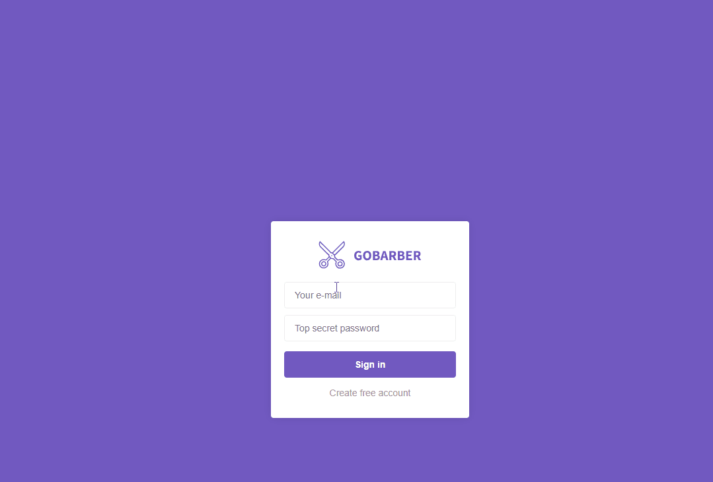

# GoBarber
Node application to schedule appointments with hairdressers

## Installing

**Yarn package manager:** you can start by installing yarn at https://yarnpkg.com/en/docs/install

**Node:** https://nodejs.org/en/

**Docker(optional):** https://www.docker.com/get-started

docker run --name database -p 5432:5432 -d -t kartoza/postgis

**Create the database:** 
* dbName: gobarber 
* user: docker 
* password: docker

Run **yarn** command into the project's tree to install all dependencies

Run **npx sequelize db:migrate** to create the necessary tables automatically

Run **yarn start**
